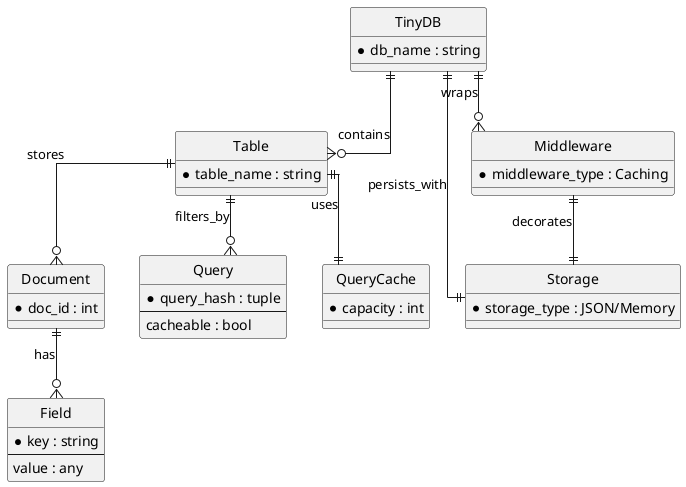

```plantuml
@startuml
skinparam linetype ortho
hide circle

entity "TinyDB" as DB {
  * db_name : string
}

entity "Table" as Tbl {
  * table_name : string
}

entity "Document" as Doc {
  * doc_id : int
}

entity "Field" as F {
  * key : string
  --
  value : any
}

entity "Query" as Q {
  * query_hash : tuple
  --
  cacheable : bool
}

entity "QueryCache" as Cache {
  * capacity : int
}

entity "Storage" as S {
  * storage_type : JSON/Memory
}

entity "Middleware" as M {
  * middleware_type : Caching
}

DB ||--o{ Tbl : contains
Tbl ||--o{ Doc : stores
Doc ||--o{ F : has
Tbl ||--o{ Q : filters_by
Tbl ||--|| Cache : uses
DB ||--|| S : persists_with
DB ||--o{ M : wraps
M ||--|| S : decorates

@enduml
```