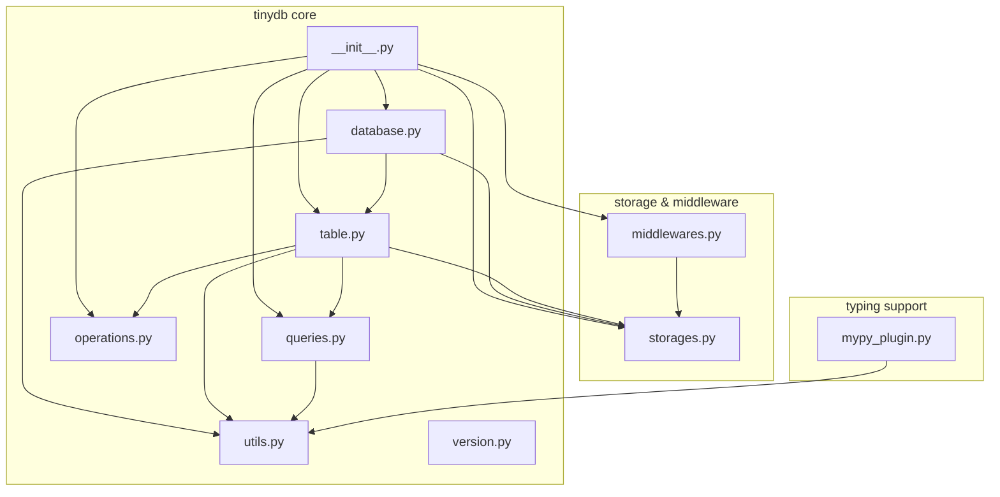

```mermaid
graph TD
    subgraph core_pkg["tinydb core"]
      init["__init__.py"]
      database["database.py"]
      table["table.py"]
      queries["queries.py"]
      operations["operations.py"]
      utils["utils.py"]
      version["version.py"]
    end

    subgraph storage_pkg["storage & middleware"]
      storages["storages.py"]
      middlewares["middlewares.py"]
    end

    subgraph typing_pkg["typing support"]
      mypy["mypy_plugin.py"]
    end

    init --> database
    init --> table
    init --> queries
    init --> storages
    init --> middlewares
    init --> operations

    database --> table
    database --> storages
    database --> utils

    table --> queries
    table --> storages
    table --> utils
    table --> operations

    queries --> utils

    middlewares --> storages

    mypy --> utils
```