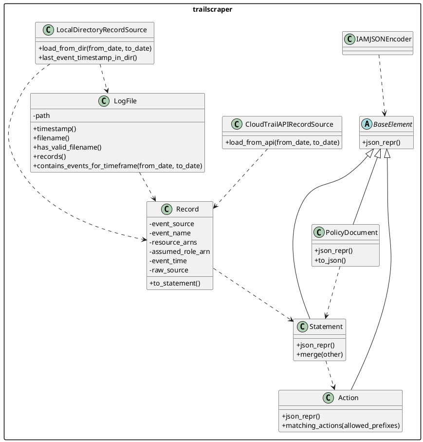

```plantuml
@startuml
skinparam classAttributeIconSize 0
skinparam packageStyle rectangle
skinparam shadowing false

package "trailscraper" {
  class Record {
    -event_source
    -event_name
    -resource_arns
    -assumed_role_arn
    -event_time
    -raw_source
    +to_statement()
  }

  class LogFile {
    -path
    +timestamp()
    +filename()
    +has_valid_filename()
    +records()
    +contains_events_for_timeframe(from_date, to_date)
  }

  abstract class BaseElement {
    +json_repr()
  }

  class Action {
    +json_repr()
    +matching_actions(allowed_prefixes)
  }

  class Statement {
    +json_repr()
    +merge(other)
  }

  class PolicyDocument {
    +json_repr()
    +to_json()
  }

  class IAMJSONEncoder

  class CloudTrailAPIRecordSource {
    +load_from_api(from_date, to_date)
  }

  class LocalDirectoryRecordSource {
    +load_from_dir(from_date, to_date)
    +last_event_timestamp_in_dir()
  }
}

BaseElement <|-- Action
BaseElement <|-- Statement
BaseElement <|-- PolicyDocument

Record ..> Statement
LogFile ..> Record
CloudTrailAPIRecordSource ..> Record
LocalDirectoryRecordSource ..> LogFile
LocalDirectoryRecordSource ..> Record

PolicyDocument ..> Statement
Statement ..> Action
IAMJSONEncoder ..> BaseElement

@enduml
```