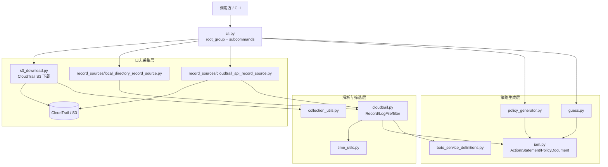

```mermaid
graph TB
    caller["调用方 / CLI"] --> cli["cli.py\nroot_group + subcommands"]

    subgraph ingestion["日志采集层"]
      s3dl["s3_download.py\nCloudTrail S3 下载"]
      local_src["record_sources/local_directory_record_source.py"]
      api_src["record_sources/cloudtrail_api_record_source.py"]
      ct[("CloudTrail / S3")]
    end

    subgraph parse_filter["解析与筛选层"]
      cloudtrail["cloudtrail.py\nRecord/LogFile/filter"]
      timeutils["time_utils.py"]
      coll["collection_utils.py"]
    end

    subgraph policy_layer["策略生成层"]
      iam["iam.py\nAction/Statement/PolicyDocument"]
      policy_gen["policy_generator.py"]
      guessmod["guess.py"]
      svcdef["boto_service_definitions.py"]
    end

    cli --> s3dl
    cli --> local_src
    cli --> api_src
    cli --> policy_gen
    cli --> guessmod

    s3dl --> ct
    api_src --> ct
    local_src --> cloudtrail
    api_src --> cloudtrail
    cloudtrail --> timeutils
    s3dl --> coll

    cloudtrail --> iam
    policy_gen --> iam
    guessmod --> iam
    cloudtrail --> svcdef
```