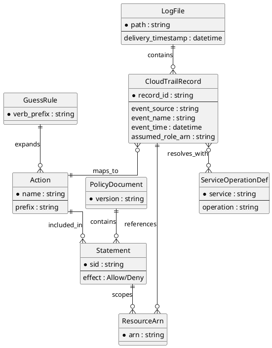

```plantuml
@startuml
skinparam linetype ortho
hide circle

entity "CloudTrailRecord" as Rec {
  * record_id : string
  --
  event_source : string
  event_name : string
  event_time : datetime
  assumed_role_arn : string
}

entity "ResourceArn" as Arn {
  * arn : string
}

entity "LogFile" as Log {
  * path : string
  --
  delivery_timestamp : datetime
}

entity "Action" as Act {
  * name : string
  --
  prefix : string
}

entity "Statement" as Stmt {
  * sid : string
  --
  effect : Allow/Deny
}

entity "PolicyDocument" as Pol {
  * version : string
}

entity "GuessRule" as Guess {
  * verb_prefix : string
}

entity "ServiceOperationDef" as Op {
  * service : string
  --
  operation : string
}

Log ||--o{ Rec : contains
Rec ||--o{ Arn : references
Rec }o--|| Act : maps_to
Act ||--o{ Stmt : included_in
Stmt ||--o{ Arn : scopes
Pol ||--o{ Stmt : contains
Guess ||--o{ Act : expands
Rec }o--o{ Op : resolves_with

@enduml
```