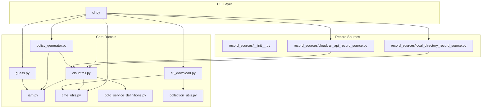

```mermaid
graph TD
    subgraph cli_layer["CLI Layer"]
      cli["cli.py"]
    end

    subgraph core_layer["Core Domain"]
      cloudtrail["cloudtrail.py"]
      iam["iam.py"]
      policygen["policy_generator.py"]
      guess["guess.py"]
      timeutils["time_utils.py"]
      svcdef["boto_service_definitions.py"]
      coll["collection_utils.py"]
      s3dl["s3_download.py"]
    end

    subgraph source_layer["Record Sources"]
      rs_init["record_sources/__init__.py"]
      rs_api["record_sources/cloudtrail_api_record_source.py"]
      rs_local["record_sources/local_directory_record_source.py"]
    end

    cli --> s3dl
    cli --> rs_api
    cli --> rs_local
    cli --> policygen
    cli --> guess
    cli --> cloudtrail
    cli --> timeutils

    rs_local --> cloudtrail
    rs_api --> cloudtrail

    cloudtrail --> iam
    cloudtrail --> svcdef
    cloudtrail --> timeutils

    policygen --> iam
    policygen --> cloudtrail
    guess --> iam

    s3dl --> coll
    s3dl --> timeutils
```