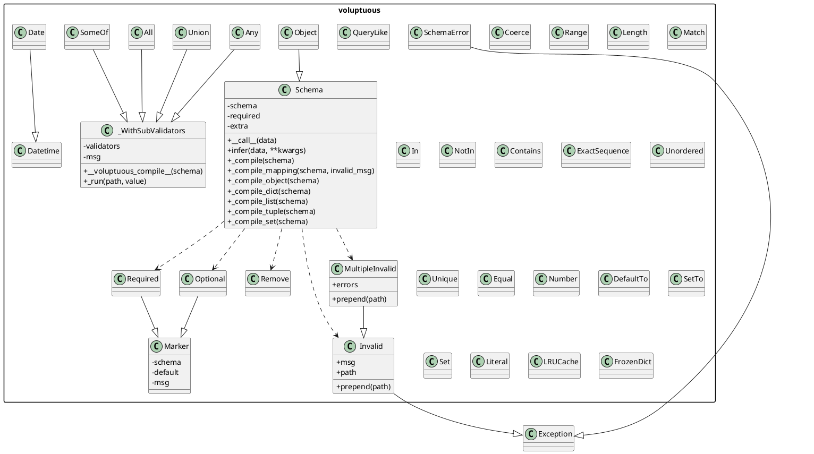

```plantuml
@startuml
skinparam classAttributeIconSize 0
skinparam packageStyle rectangle
skinparam shadowing false

package "voluptuous" {
  class Schema {
    -schema
    -required
    -extra
    +__call__(data)
    +infer(data, **kwargs)
    +_compile(schema)
    +_compile_mapping(schema, invalid_msg)
    +_compile_object(schema)
    +_compile_dict(schema)
    +_compile_list(schema)
    +_compile_tuple(schema)
    +_compile_set(schema)
  }

  class Marker {
    -schema
    -default
    -msg
  }
  class Required
  class Optional
  class Remove

  class Object

  class QueryLike

  class Invalid {
    +msg
    +path
    +prepend(path)
  }
  class MultipleInvalid {
    +errors
    +prepend(path)
  }
  class SchemaError

  class _WithSubValidators {
    -validators
    -msg
    +__voluptuous_compile__(schema)
    +_run(path, value)
  }

  class Any
  class Union
  class All
  class SomeOf

  class Coerce
  class Range
  class Length
  class Match
  class Datetime
  class Date
  class In
  class NotIn
  class Contains
  class ExactSequence
  class Unordered
  class Unique
  class Equal
  class Number

  class DefaultTo
  class SetTo
  class Set
  class Literal

  class LRUCache
  class FrozenDict
}

Required --|> Marker
Optional --|> Marker
Remove --|> Marker
Object --|> Schema

MultipleInvalid --|> Invalid
SchemaError --|> Exception
Invalid --|> Exception

Any --|> _WithSubValidators
Union --|> _WithSubValidators
All --|> _WithSubValidators
SomeOf --|> _WithSubValidators

Date --|> Datetime

Schema ..> Required
Schema ..> Optional
Schema ..> Remove
Schema ..> Invalid
Schema ..> MultipleInvalid

@enduml
```