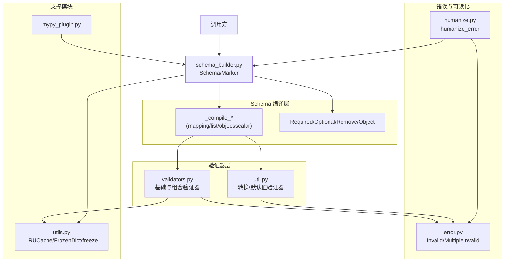

```mermaid
graph TB
    caller["调用方"] --> schema_api["schema_builder.py\nSchema/Marker"]

    subgraph compile_layer["Schema 编译层"]
      compile_map["_compile_*\n(mapping/list/object/scalar)"]
      markers["Required/Optional/Remove/Object"]
    end

    subgraph validator_layer["验证器层"]
      validators["validators.py\n基础与组合验证器"]
      utilmod["util.py\n转换/默认值验证器"]
    end

    subgraph error_layer["错误与可读化"]
      errors["error.py\nInvalid/MultipleInvalid"]
      humanize["humanize.py\nhumanize_error"]
    end

    subgraph support["支撑模块"]
      cache["utils.py\nLRUCache/FrozenDict/freeze"]
      mypy["mypy_plugin.py"]
    end

    schema_api --> compile_map
    schema_api --> markers
    compile_map --> validators
    compile_map --> utilmod

    validators --> errors
    utilmod --> errors

    humanize --> errors
    humanize --> schema_api

    validators --> cache
    schema_api --> cache
    mypy --> schema_api
```