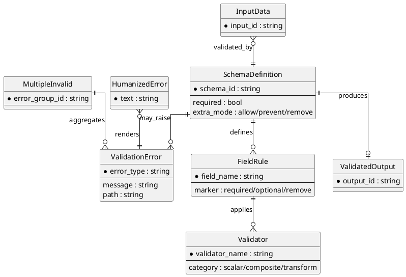

```plantuml
@startuml
skinparam linetype ortho
hide circle

entity "SchemaDefinition" as SD {
  * schema_id : string
  --
  required : bool
  extra_mode : allow/prevent/remove
}

entity "FieldRule" as FR {
  * field_name : string
  --
  marker : required/optional/remove
}

entity "Validator" as V {
  * validator_name : string
  --
  category : scalar/composite/transform
}

entity "InputData" as ID {
  * input_id : string
}

entity "ValidatedOutput" as VO {
  * output_id : string
}

entity "ValidationError" as VE {
  * error_type : string
  --
  message : string
  path : string
}

entity "MultipleInvalid" as MVE {
  * error_group_id : string
}

entity "HumanizedError" as HE {
  * text : string
}

SD ||--o{ FR : defines
FR ||--o{ V : applies
ID }o--|| SD : validated_by
SD ||--o| VO : produces
SD ||--o{ VE : may_raise
MVE ||--o{ VE : aggregates
HE }o--|| VE : renders

@enduml
```