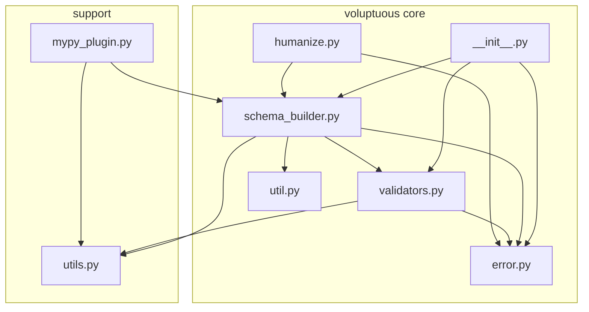

```mermaid
graph TD
    subgraph core_pkg["voluptuous core"]
      init["__init__.py"]
      schema["schema_builder.py"]
      validators["validators.py"]
      util["util.py"]
      errors["error.py"]
      humanize["humanize.py"]
    end

    subgraph support_pkg["support"]
      utils["utils.py"]
      mypy["mypy_plugin.py"]
    end

    init --> schema
    init --> validators
    init --> errors

    schema --> validators
    schema --> util
    schema --> errors
    schema --> utils

    validators --> errors
    validators --> utils

    humanize --> errors
    humanize --> schema

    mypy --> utils
    mypy --> schema
```