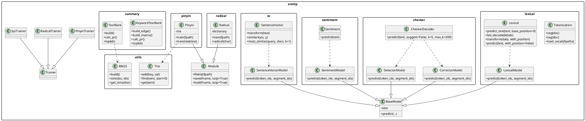

```plantuml
@startuml
skinparam classAttributeIconSize 0
skinparam packageStyle rectangle
skinparam shadowing false

package "xmnlp" {
  class BaseModel {
    -sess
    +predict(...)
  }

  class Module {
    +filelist(fpath)
    +save(fname, iszip=True)
    +load(fname, iszip=True)
  }

  class Trainer
  class PinyinTrainer
  class RadicalTrainer
  class SysTrainer
}

package "xmnlp.lexical" {
  class Tokenization {
    +seg(doc)
    +tag(doc)
    +load_vocab(fpaths)
  }

  class LexicalModel {
    +predict(token_ids, segment_ids)
  }

  class Lexical {
    +predict_one(text, base_position=0)
    +bio_decode(labels)
    +transform(data, with_position)
    +predict(text, with_position=False)
  }
}

package "xmnlp.checker" {
  class DetectorModel {
    +predict(token_ids, segment_ids)
  }

  class CorrectorModel {
    +predict(token_ids, segment_ids)
  }

  class CheckerDecoder {
    +predict(text, suggest=False, k=5, max_k=200)
  }
}

package "xmnlp.sentiment" {
  class SentimentModel {
    +predict(token_ids, segment_ids)
  }

  class Sentiment {
    +predict(text)
  }
}

package "xmnlp.sv" {
  class SentenceVectorModel {
    +predict(token_ids, segment_ids)
  }

  class SentenceVector {
    +transform(text)
    +similarity(x, y)
    +most_similar(query, docs, k=1)
  }
}

package "xmnlp.pinyin" {
  class Pinyin {
    -trie
    +train(fpath)
    +translate(text)
  }
}

package "xmnlp.radical" {
  class Radical {
    -dictionary
    +train(fpath)
    +radical(char)
  }
}

package "xmnlp.summary" {
  class KeywordTextRank {
    +build_edge()
    +build_matrix()
    +calc_pr()
    +topk(k)
  }

  class TextRank {
    +build()
    +calc_pr()
    +topk(k)
  }
}

package "xmnlp.utils" {
  class BM25 {
    +build()
    +sim(doc, idx)
    +get_sims(doc)
  }

  class Trie {
    +add(key, val)
    +find(sent, start=0)
    +get(sent)
  }
}

PinyinTrainer --|> Trainer
RadicalTrainer --|> Trainer
SysTrainer --|> Trainer

LexicalModel --|> BaseModel
DetectorModel --|> BaseModel
CorrectorModel --|> BaseModel
SentimentModel --|> BaseModel
SentenceVectorModel --|> BaseModel

Pinyin --|> Module
Radical --|> Module

Lexical ..> LexicalModel
CheckerDecoder ..> DetectorModel
CheckerDecoder ..> CorrectorModel
Sentiment ..> SentimentModel
SentenceVector ..> SentenceVectorModel
TextRank ..> BM25
Pinyin ..> Trie

@enduml
```