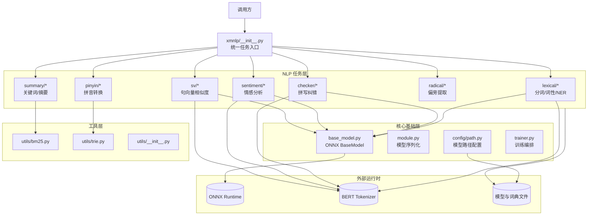

```mermaid
graph TB
    caller["调用方"] --> entry["xmnlp/__init__.py\n统一任务入口"]

    subgraph core["核心基础层"]
      base["base_model.py\nONNX BaseModel"]
      module["module.py\n模型序列化"]
      config["config/path.py\n模型路径配置"]
      trainer["trainer.py\n训练编排"]
    end

    subgraph tasks["NLP 任务层"]
      lexical["lexical/*\n分词/词性/NER"]
      checker["checker/*\n拼写纠错"]
      sentiment["sentiment/*\n情感分析"]
      summary["summary/*\n关键词/摘要"]
      pinyin["pinyin/*\n拼音转换"]
      radical["radical/*\n偏旁提取"]
      sv["sv/*\n句向量相似度"]
    end

    subgraph support["工具层"]
      bm25["utils/bm25.py"]
      trie["utils/trie.py"]
      uinit["utils/__init__.py"]
    end

    subgraph runtime["外部运行时"]
      onnx[("ONNX Runtime")]
      tokenizer[("BERT Tokenizer")]
      model_files[("模型与词典文件")]
    end

    entry --> lexical
    entry --> checker
    entry --> sentiment
    entry --> summary
    entry --> pinyin
    entry --> radical
    entry --> sv

    lexical --> base
    checker --> base
    sentiment --> base
    sv --> base

    summary --> bm25
    pinyin --> trie

    lexical --> tokenizer
    checker --> tokenizer
    sentiment --> tokenizer
    sv --> tokenizer

    base --> onnx
    config --> model_files
    tasks --> model_files
```