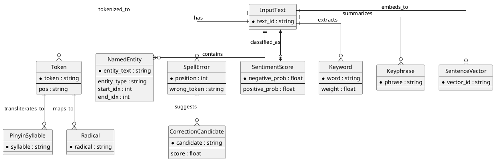

```plantuml
@startuml
skinparam linetype ortho
hide circle

entity "InputText" as Txt {
  * text_id : string
}

entity "Token" as Tok {
  * token : string
  --
  pos : string
}

entity "NamedEntity" as Ent {
  * entity_text : string
  --
  entity_type : string
  start_idx : int
  end_idx : int
}

entity "SpellError" as Err {
  * position : int
  --
  wrong_token : string
}

entity "CorrectionCandidate" as Cand {
  * candidate : string
  --
  score : float
}

entity "SentimentScore" as Sent {
  * negative_prob : float
  --
  positive_prob : float
}

entity "Keyword" as Kw {
  * word : string
  --
  weight : float
}

entity "Keyphrase" as Kp {
  * phrase : string
}

entity "PinyinSyllable" as Py {
  * syllable : string
}

entity "Radical" as Rad {
  * radical : string
}

entity "SentenceVector" as Vec {
  * vector_id : string
}

Txt ||--o{ Tok : tokenized_to
Txt ||--o{ Ent : contains
Txt ||--o{ Err : has
Err ||--o{ Cand : suggests
Txt ||--o| Sent : classified_as
Txt ||--o{ Kw : extracts
Txt ||--o{ Kp : summarizes
Tok ||--o{ Py : transliterates_to
Tok ||--o{ Rad : maps_to
Txt ||--o| Vec : embeds_to

@enduml
```