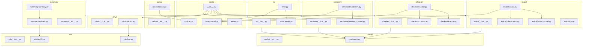

```mermaid
graph TD
    subgraph xmnlp_root["xmnlp"]
      init["__init__.py"]
      base_model["base_model.py"]
      module["module.py"]
      trainer["trainer.py"]
    end

    subgraph cfg["config"]
      cfg_init["config/__init__.py"]
      cfg_path["config/path.py"]
    end

    subgraph lexical_pkg["lexical"]
      lex_init["lexical/__init__.py"]
      lexical["lexical/lexical.py"]
      lexical_model["lexical/lexical_model.py"]
      tokenization["lexical/tokenization.py"]
      trie_lex["lexical/trie.py"]
    end

    subgraph checker_pkg["checker"]
      chk_init["checker/__init__.py"]
      checker["checker/checker.py"]
      detector["checker/detector.py"]
      corrector["checker/corrector.py"]
    end

    subgraph sentiment_pkg["sentiment"]
      sent_init["sentiment/__init__.py"]
      sentiment["sentiment/sentiment.py"]
      sentiment_model["sentiment/sentiment_model.py"]
    end

    subgraph summary_pkg["summary"]
      sum_init["summary/__init__.py"]
      summary["summary/summary.py"]
      textrank["summary/textrank.py"]
    end

    subgraph pinyin_pkg["pinyin"]
      py_init["pinyin/__init__.py"]
      pinyin["pinyin/pinyin.py"]
    end

    subgraph radical_pkg["radical"]
      rad_init["radical/__init__.py"]
      radical["radical/radical.py"]
    end

    subgraph sv_pkg["sv"]
      sv_init["sv/__init__.py"]
      sv["sv/sv.py"]
      sv_model["sv/sv_model.py"]
    end

    subgraph utils_pkg["utils"]
      utils_init["utils/__init__.py"]
      bm25["utils/bm25.py"]
      trie["utils/trie.py"]
    end

    init --> lexical_pkg
    init --> checker_pkg
    init --> sentiment_pkg
    init --> summary_pkg
    init --> pinyin_pkg
    init --> radical_pkg
    init --> sv_pkg

    lexical --> lexical_model
    lexical --> tokenization
    lexical --> base_model

    checker --> detector
    checker --> corrector
    checker --> base_model

    sentiment --> sentiment_model
    sentiment --> base_model

    sv --> sv_model
    sv --> base_model

    summary --> textrank
    textrank --> bm25

    pinyin --> trie
    radical --> module

    lexical_pkg --> cfg_path
    checker_pkg --> cfg_path
    sentiment_pkg --> cfg_path
    sv_pkg --> cfg_path
```