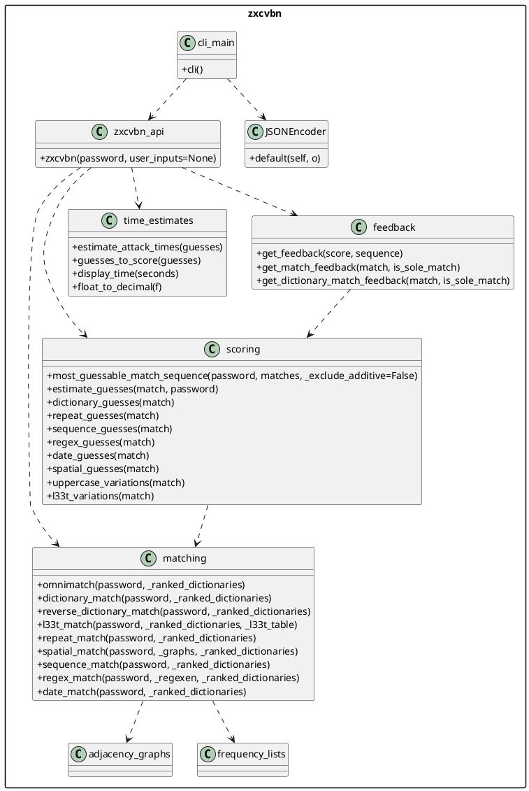

```plantuml
@startuml
skinparam classAttributeIconSize 0
skinparam packageStyle rectangle
skinparam shadowing false

package "zxcvbn" {
  class zxcvbn_api {
    +zxcvbn(password, user_inputs=None)
  }

  class matching {
    +omnimatch(password, _ranked_dictionaries)
    +dictionary_match(password, _ranked_dictionaries)
    +reverse_dictionary_match(password, _ranked_dictionaries)
    +l33t_match(password, _ranked_dictionaries, _l33t_table)
    +repeat_match(password, _ranked_dictionaries)
    +spatial_match(password, _graphs, _ranked_dictionaries)
    +sequence_match(password, _ranked_dictionaries)
    +regex_match(password, _regexen, _ranked_dictionaries)
    +date_match(password, _ranked_dictionaries)
  }

  class scoring {
    +most_guessable_match_sequence(password, matches, _exclude_additive=False)
    +estimate_guesses(match, password)
    +dictionary_guesses(match)
    +repeat_guesses(match)
    +sequence_guesses(match)
    +regex_guesses(match)
    +date_guesses(match)
    +spatial_guesses(match)
    +uppercase_variations(match)
    +l33t_variations(match)
  }

  class time_estimates {
    +estimate_attack_times(guesses)
    +guesses_to_score(guesses)
    +display_time(seconds)
    +float_to_decimal(f)
  }

  class feedback {
    +get_feedback(score, sequence)
    +get_match_feedback(match, is_sole_match)
    +get_dictionary_match_feedback(match, is_sole_match)
  }

  class JSONEncoder {
    +default(self, o)
  }

  class cli_main {
    +cli()
  }

  class adjacency_graphs
  class frequency_lists
}

zxcvbn_api ..> matching
zxcvbn_api ..> scoring
zxcvbn_api ..> time_estimates
zxcvbn_api ..> feedback

matching ..> adjacency_graphs
matching ..> frequency_lists
scoring ..> matching
feedback ..> scoring

cli_main ..> zxcvbn_api
cli_main ..> JSONEncoder

@enduml
```