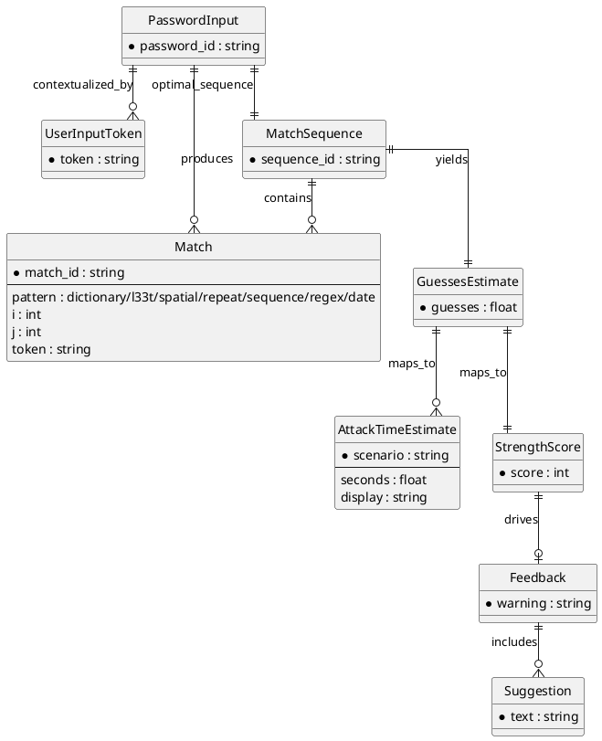

```plantuml
@startuml
skinparam linetype ortho
hide circle

entity "PasswordInput" as Pwd {
  * password_id : string
}

entity "UserInputToken" as UIT {
  * token : string
}

entity "Match" as M {
  * match_id : string
  --
  pattern : dictionary/l33t/spatial/repeat/sequence/regex/date
  i : int
  j : int
  token : string
}

entity "MatchSequence" as Seq {
  * sequence_id : string
}

entity "GuessesEstimate" as G {
  * guesses : float
}

entity "AttackTimeEstimate" as T {
  * scenario : string
  --
  seconds : float
  display : string
}

entity "StrengthScore" as S {
  * score : int
}

entity "Feedback" as F {
  * warning : string
}

entity "Suggestion" as Sug {
  * text : string
}

Pwd ||--o{ UIT : contextualized_by
Pwd ||--o{ M : produces
Seq ||--o{ M : contains
Pwd ||--|| Seq : optimal_sequence
Seq ||--|| G : yields
G ||--o{ T : maps_to
G ||--|| S : maps_to
S ||--o| F : drives
F ||--o{ Sug : includes

@enduml
```