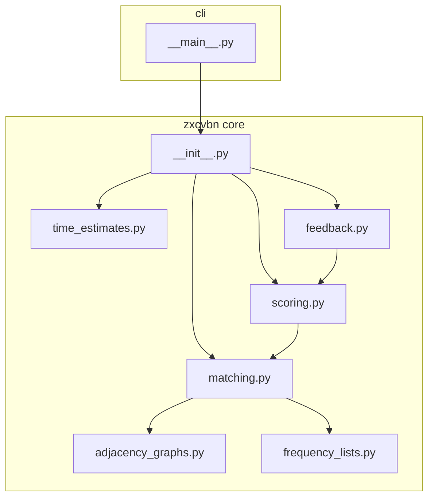

```mermaid
graph TD
    subgraph core_pkg["zxcvbn core"]
      init["__init__.py"]
      matching["matching.py"]
      scoring["scoring.py"]
      timeest["time_estimates.py"]
      feedback["feedback.py"]
      graphs["adjacency_graphs.py"]
      freqs["frequency_lists.py"]
    end

    subgraph cli_pkg["cli"]
      main["__main__.py"]
    end

    init --> matching
    init --> scoring
    init --> timeest
    init --> feedback

    matching --> freqs
    matching --> graphs
    scoring --> matching
    feedback --> scoring

    main --> init
```