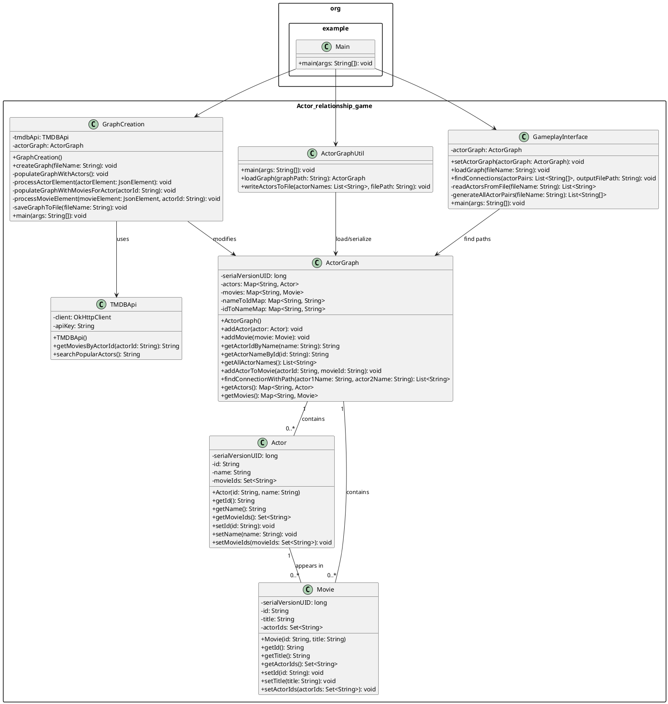

```plantuml
@startuml
skinparam classAttributeIconSize 0
skinparam shadowing false
skinparam packageStyle rectangle

package "Actor_relationship_game" {

    class Actor {
        -serialVersionUID: long
        -id: String
        -name: String
        -movieIds: Set<String>
        +Actor(id: String, name: String)
        +getId(): String
        +getName(): String
        +getMovieIds(): Set<String>
        +setId(id: String): void
        +setName(name: String): void
        +setMovieIds(movieIds: Set<String>): void
    }

    class Movie {
        -serialVersionUID: long
        -id: String
        -title: String
        -actorIds: Set<String>
        +Movie(id: String, title: String)
        +getId(): String
        +getTitle(): String
        +getActorIds(): Set<String>
        +setId(id: String): void
        +setTitle(title: String): void
        +setActorIds(actorIds: Set<String>): void
    }

    class ActorGraph {
        -serialVersionUID: long
        -actors: Map<String, Actor>
        -movies: Map<String, Movie>
        -nameToIdMap: Map<String, String>
        -idToNameMap: Map<String, String>
        +ActorGraph()
        +addActor(actor: Actor): void
        +addMovie(movie: Movie): void
        +getActorIdByName(name: String): String
        +getActorNameById(id: String): String
        +getAllActorNames(): List<String>
        +addActorToMovie(actorId: String, movieId: String): void
        +findConnectionWithPath(actor1Name: String, actor2Name: String): List<String>
        +getActors(): Map<String, Actor>
        +getMovies(): Map<String, Movie>
    }

    class TMDBApi {
        -client: OkHttpClient
        -apiKey: String
        +TMDBApi()
        +getMoviesByActorId(actorId: String): String
        +searchPopularActors(): String
    }

    class GraphCreation {
        -tmdbApi: TMDBApi
        -actorGraph: ActorGraph
        +GraphCreation()
        +createGraph(fileName: String): void
        -populateGraphWithActors(): void
        -processActorElement(actorElement: JsonElement): void
        -populateGraphWithMoviesForActor(actorId: String): void
        -processMovieElement(movieElement: JsonElement, actorId: String): void
        -saveGraphToFile(fileName: String): void
        +main(args: String[]): void
    }

    class ActorGraphUtil {
        +main(args: String[]): void
        +loadGraph(graphPath: String): ActorGraph
        +writeActorsToFile(actorNames: List<String>, filePath: String): void
    }

    class GameplayInterface {
        -actorGraph: ActorGraph
        +setActorGraph(actorGraph: ActorGraph): void
        +loadGraph(fileName: String): void
        +findConnections(actorPairs: List<String[]>, outputFilePath: String): void
        -readActorsFromFile(fileName: String): List<String>
        -generateAllActorPairs(fileName: String): List<String[]>
        +main(args: String[]): void
    }
}

package "org.example" {
    class Main {
        +main(args: String[]): void
    }
}

Actor "1" -- "0..*" Movie : appears in
ActorGraph "1" -- "0..*" Actor : contains
ActorGraph "1" -- "0..*" Movie : contains
GraphCreation --> TMDBApi : uses
GraphCreation --> ActorGraph : modifies
ActorGraphUtil --> ActorGraph : load/serialize
GameplayInterface --> ActorGraph : find paths
Main --> GraphCreation
Main --> ActorGraphUtil
Main --> GameplayInterface

@enduml
```