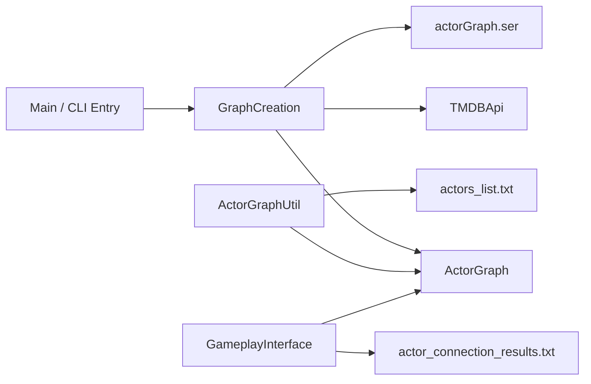

```mermaid
graph LR
    A["Main / CLI Entry"] --> B["GraphCreation"]
    B --> C["TMDBApi"]
    B --> D["ActorGraph"]
    E["ActorGraphUtil"] --> D
    F["GameplayInterface"] --> D
    F --> G["actor_connection_results.txt"]
    E --> H["actors_list.txt"]
    B --> I["actorGraph.ser"]
```