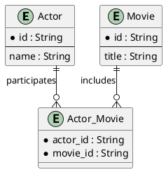

```plantuml
@startuml
skinparam linetype ortho
skinparam shadowing false

entity "Actor" as Actor {
  * id : String
  --
  name : String
}

entity "Movie" as Movie {
  * id : String
  --
  title : String
}

entity "Actor_Movie" as ActorMovie {
  * actor_id : String
  * movie_id : String
}

Actor ||--o{ ActorMovie : participates
Movie ||--o{ ActorMovie : includes

@enduml
```