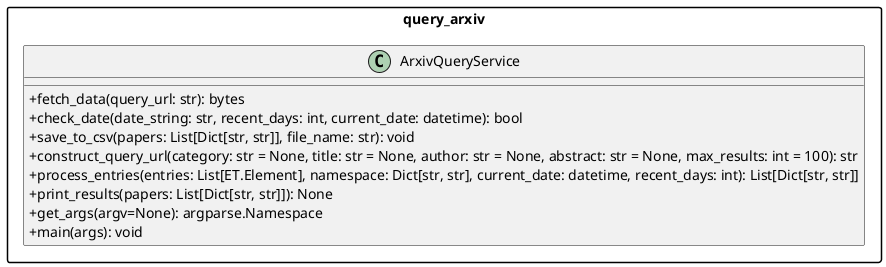

```plantuml
@startuml
skinparam classAttributeIconSize 0
skinparam shadowing false
skinparam packageStyle rectangle

package "query_arxiv" {
  class ArxivQueryService {
    +fetch_data(query_url: str): bytes
    +check_date(date_string: str, recent_days: int, current_date: datetime): bool
    +save_to_csv(papers: List[Dict[str, str]], file_name: str): void
    +construct_query_url(category: str = None, title: str = None, author: str = None, abstract: str = None, max_results: int = 100): str
    +process_entries(entries: List[ET.Element], namespace: Dict[str, str], current_date: datetime, recent_days: int): List[Dict[str, str]]
    +print_results(papers: List[Dict[str, str]]): None
    +get_args(argv=None): argparse.Namespace
    +main(args): void
  }
}

@enduml
```