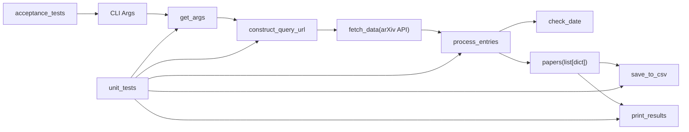

```mermaid
graph LR
    A["CLI Args"] --> B["get_args"]
    B --> C["construct_query_url"]
    C --> D["fetch_data(arXiv API)"]
    D --> E["process_entries"]
    E --> F["check_date"]
    E --> G["papers(list[dict])"]
    G --> H["save_to_csv"]
    G --> I["print_results"]
    J["unit_tests"] --> B
    J --> C
    J --> E
    J --> H
    J --> I
    K["acceptance_tests"] --> A
```