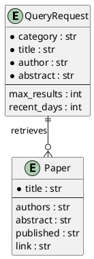

```plantuml
@startuml
skinparam linetype ortho
skinparam shadowing false

entity "QueryRequest" as QueryRequest {
  * category : str
  * title : str
  * author : str
  * abstract : str
  --
  max_results : int
  recent_days : int
}

entity "Paper" as Paper {
  * title : str
  --
  authors : str
  abstract : str
  published : str
  link : str
}

QueryRequest ||--o{ Paper : retrieves

@enduml
```