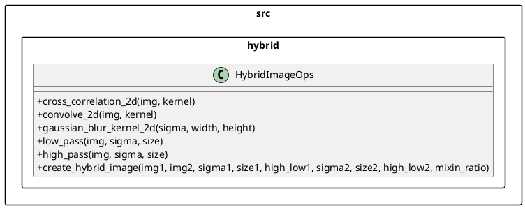

```plantuml
@startuml
skinparam classAttributeIconSize 0
skinparam shadowing false
skinparam packageStyle rectangle

package "src.hybrid" {
  class HybridImageOps {
    +cross_correlation_2d(img, kernel)
    +convolve_2d(img, kernel)
    +gaussian_blur_kernel_2d(sigma, width, height)
    +low_pass(img, sigma, size)
    +high_pass(img, sigma, size)
    +create_hybrid_image(img1, img2, sigma1, size1, high_low1, sigma2, size2, high_low2, mixin_ratio)
  }
}

@enduml
```