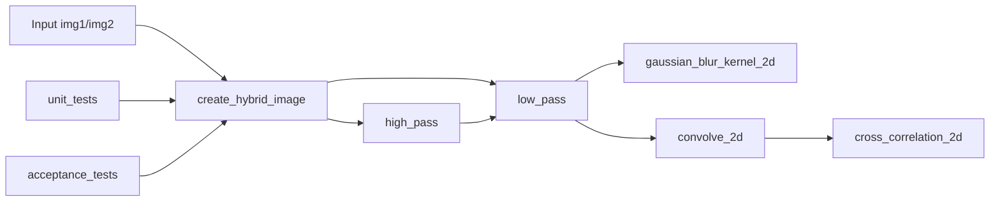

```mermaid
graph LR
    A["Input img1/img2"] --> B["create_hybrid_image"]
    B --> C["low_pass"]
    B --> D["high_pass"]
    C --> E["gaussian_blur_kernel_2d"]
    C --> F["convolve_2d"]
    F --> G["cross_correlation_2d"]
    D --> C
    H["unit_tests"] --> B
    I["acceptance_tests"] --> B
```