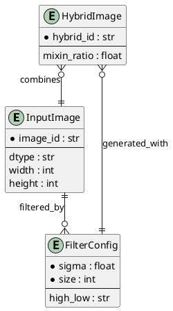

```plantuml
@startuml
skinparam linetype ortho
skinparam shadowing false

entity "InputImage" as InputImage {
  * image_id : str
  --
  dtype : str
  width : int
  height : int
}

entity "FilterConfig" as FilterConfig {
  * sigma : float
  * size : int
  --
  high_low : str
}

entity "HybridImage" as HybridImage {
  * hybrid_id : str
  --
  mixin_ratio : float
}

InputImage ||--o{ FilterConfig : filtered_by
HybridImage }o--|| FilterConfig : generated_with
HybridImage }o--|| InputImage : combines

@enduml
```