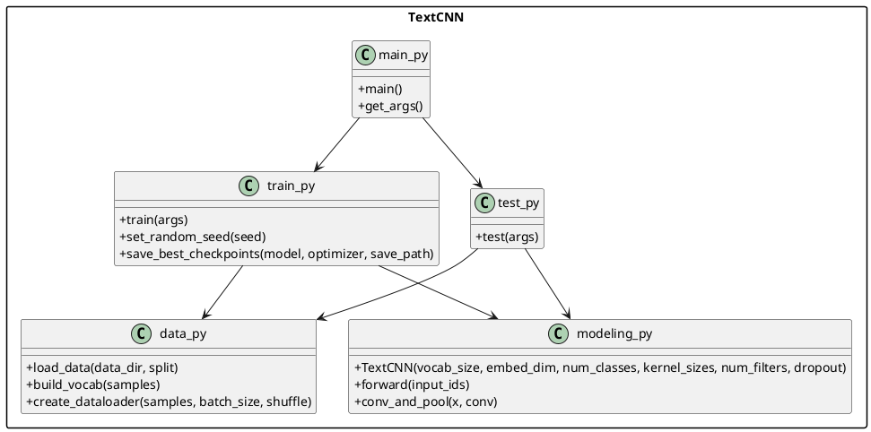

```plantuml
@startuml
skinparam classAttributeIconSize 0
skinparam shadowing false
skinparam packageStyle rectangle

package "TextCNN" {
  class main_py {
    +main()
    +get_args()
  }

  class train_py {
    +train(args)
    +set_random_seed(seed)
    +save_best_checkpoints(model, optimizer, save_path)
  }

  class test_py {
    +test(args)
  }

  class data_py {
    +load_data(data_dir, split)
    +build_vocab(samples)
    +create_dataloader(samples, batch_size, shuffle)
  }

  class modeling_py {
    +TextCNN(vocab_size, embed_dim, num_classes, kernel_sizes, num_filters, dropout)
    +forward(input_ids)
    +conv_and_pool(x, conv)
  }
}

main_py --> train_py
main_py --> test_py
train_py --> data_py
test_py --> data_py
train_py --> modeling_py
test_py --> modeling_py

@enduml
```