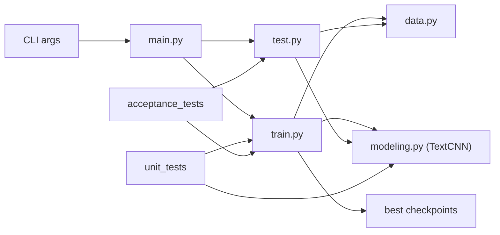

```mermaid
graph LR
    A["CLI args"] --> B["main.py"]
    B --> C["train.py"]
    B --> D["test.py"]
    C --> E["data.py"]
    C --> F["modeling.py (TextCNN)"]
    D --> E
    D --> F
    C --> G["best checkpoints"]
    H["unit_tests"] --> C
    H --> F
    I["acceptance_tests"] --> C
    I --> D
```