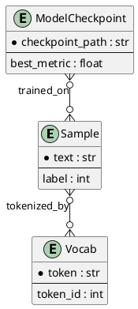

```plantuml
@startuml
skinparam linetype ortho
skinparam shadowing false

entity "Sample" as Sample {
  * text : str
  --
  label : int
}

entity "Vocab" as Vocab {
  * token : str
  --
  token_id : int
}

entity "ModelCheckpoint" as ModelCheckpoint {
  * checkpoint_path : str
  --
  best_metric : float
}

Sample }o--o{ Vocab : tokenized_by
ModelCheckpoint }o--o{ Sample : trained_on

@enduml
```