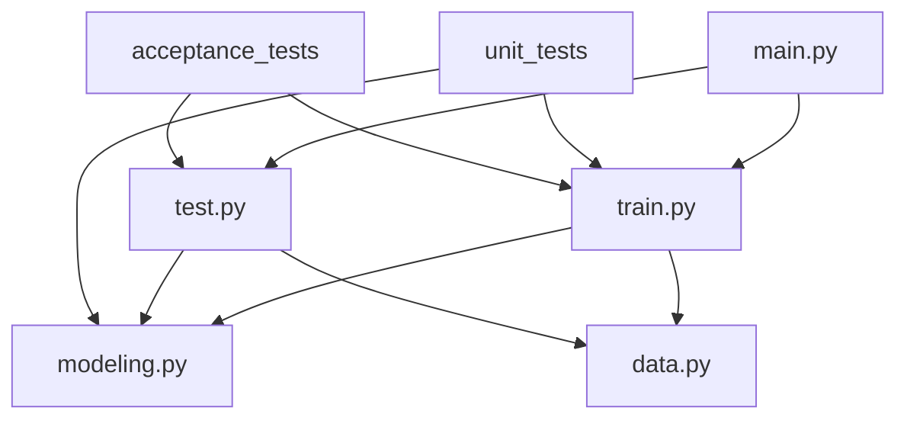

```mermaid
graph TD
    P1["main.py"]
    P2["train.py"]
    P3["test.py"]
    P4["modeling.py"]
    P5["data.py"]
    P6["unit_tests"]
    P7["acceptance_tests"]

    P1 --> P2
    P1 --> P3
    P2 --> P4
    P2 --> P5
    P3 --> P4
    P3 --> P5
    P6 --> P2
    P6 --> P4
    P7 --> P2
    P7 --> P3
```