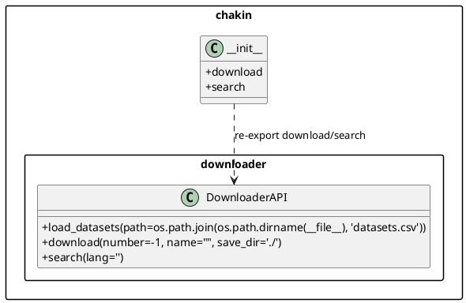

```plantuml
@startuml
skinparam classAttributeIconSize 0
skinparam shadowing false
skinparam packageStyle rectangle

package "chakin.downloader" {
  class DownloaderAPI {
    +load_datasets(path=os.path.join(os.path.dirname(__file__), 'datasets.csv'))
    +download(number=-1, name="", save_dir='./')
    +search(lang='')
  }
}

package "chakin" {
  class __init__ {
    +download
    +search
  }
}

__init__ ..> DownloaderAPI : re-export download/search

@enduml
```