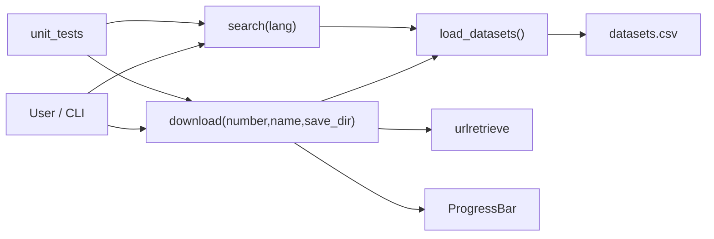

```mermaid
graph LR
    A["User / CLI"] --> B["download(number,name,save_dir)"]
    A --> C["search(lang)"]
    B --> D["load_datasets()"]
    C --> D
    D --> E["datasets.csv"]
    B --> F["urlretrieve"]
    B --> G["ProgressBar"]
    H["unit_tests"] --> B
    H --> C
```