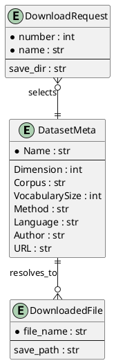

```plantuml
@startuml
skinparam linetype ortho
skinparam shadowing false

entity "DatasetMeta" as DatasetMeta {
  * Name : str
  --
  Dimension : int
  Corpus : str
  VocabularySize : int
  Method : str
  Language : str
  Author : str
  URL : str
}

entity "DownloadRequest" as DownloadRequest {
  * number : int
  * name : str
  --
  save_dir : str
}

entity "DownloadedFile" as DownloadedFile {
  * file_name : str
  --
  save_path : str
}

DownloadRequest }o--|| DatasetMeta : selects
DatasetMeta ||--o{ DownloadedFile : resolves_to

@enduml
```