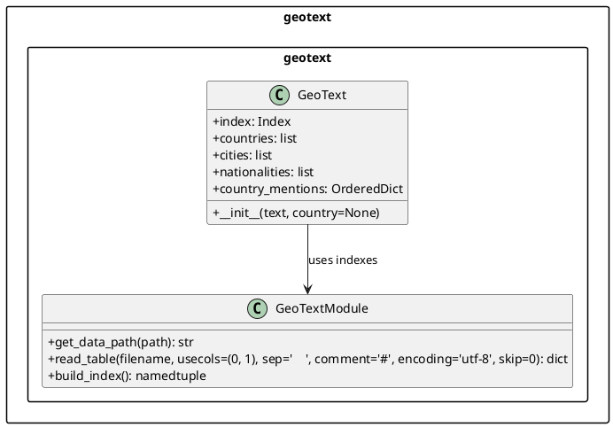

```plantuml
@startuml
skinparam classAttributeIconSize 0
skinparam shadowing false
skinparam packageStyle rectangle

package "geotext.geotext" {
  class GeoTextModule {
    +get_data_path(path): str
    +read_table(filename, usecols=(0, 1), sep='\t', comment='#', encoding='utf-8', skip=0): dict
    +build_index(): namedtuple
  }

  class GeoText {
    +index: Index
    +__init__(text, country=None)
    +countries: list
    +cities: list
    +nationalities: list
    +country_mentions: OrderedDict
  }
}

GeoText --> GeoTextModule : uses indexes

@enduml
```