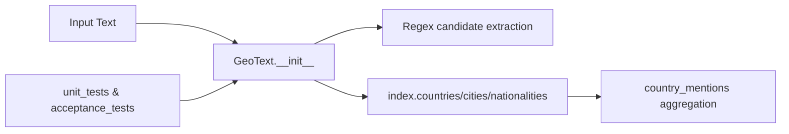

```mermaid
graph LR
    A["Input Text"] --> B["GeoText.__init__"]
    B --> C["Regex candidate extraction"]
    B --> D["index.countries/cities/nationalities"]
    D --> E["country_mentions aggregation"]
    F["unit_tests & acceptance_tests"] --> B
```