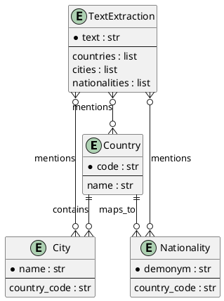

```plantuml
@startuml
skinparam linetype ortho
skinparam shadowing false

entity "Country" as Country {
  * code : str
  --
  name : str
}

entity "City" as City {
  * name : str
  --
  country_code : str
}

entity "Nationality" as Nationality {
  * demonym : str
  --
  country_code : str
}

entity "TextExtraction" as TextExtraction {
  * text : str
  --
  countries : list
  cities : list
  nationalities : list
}

Country ||--o{ City : contains
Country ||--o{ Nationality : maps_to
TextExtraction }o--o{ Country : mentions
TextExtraction }o--o{ City : mentions
TextExtraction }o--o{ Nationality : mentions

@enduml
```