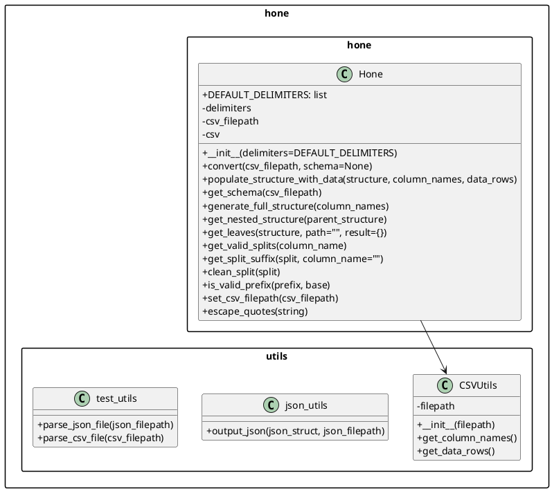

```plantuml
@startuml
skinparam classAttributeIconSize 0
skinparam shadowing false
skinparam packageStyle rectangle

package "hone.hone" {
  class Hone {
    +DEFAULT_DELIMITERS: list
    -delimiters
    -csv_filepath
    -csv
    +__init__(delimiters=DEFAULT_DELIMITERS)
    +convert(csv_filepath, schema=None)
    +populate_structure_with_data(structure, column_names, data_rows)
    +get_schema(csv_filepath)
    +generate_full_structure(column_names)
    +get_nested_structure(parent_structure)
    +get_leaves(structure, path="", result={})
    +get_valid_splits(column_name)
    +get_split_suffix(split, column_name="")
    +clean_split(split)
    +is_valid_prefix(prefix, base)
    +set_csv_filepath(csv_filepath)
    +escape_quotes(string)
  }
}

package "hone.utils" {
  class CSVUtils {
    -filepath
    +__init__(filepath)
    +get_column_names()
    +get_data_rows()
  }

  class json_utils {
    +output_json(json_struct, json_filepath)
  }

  class test_utils {
    +parse_json_file(json_filepath)
    +parse_csv_file(csv_filepath)
  }
}

Hone --> CSVUtils

@enduml
```