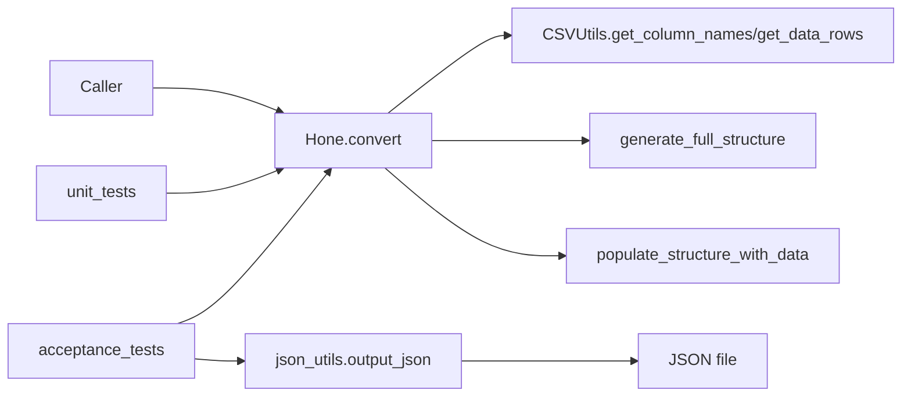

```mermaid
graph LR
    A["Caller"] --> B["Hone.convert"]
    B --> C["CSVUtils.get_column_names/get_data_rows"]
    B --> D["generate_full_structure"]
    B --> E["populate_structure_with_data"]
    F["json_utils.output_json"] --> G["JSON file"]
    H["unit_tests"] --> B
    I["acceptance_tests"] --> B
    I --> F
```