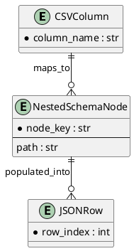

```plantuml
@startuml
skinparam linetype ortho
skinparam shadowing false

entity "CSVColumn" as CSVColumn {
  * column_name : str
}

entity "NestedSchemaNode" as NestedSchemaNode {
  * node_key : str
  --
  path : str
}

entity "JSONRow" as JSONRow {
  * row_index : int
}

CSVColumn ||--o{ NestedSchemaNode : maps_to
NestedSchemaNode ||--o{ JSONRow : populated_into

@enduml
```