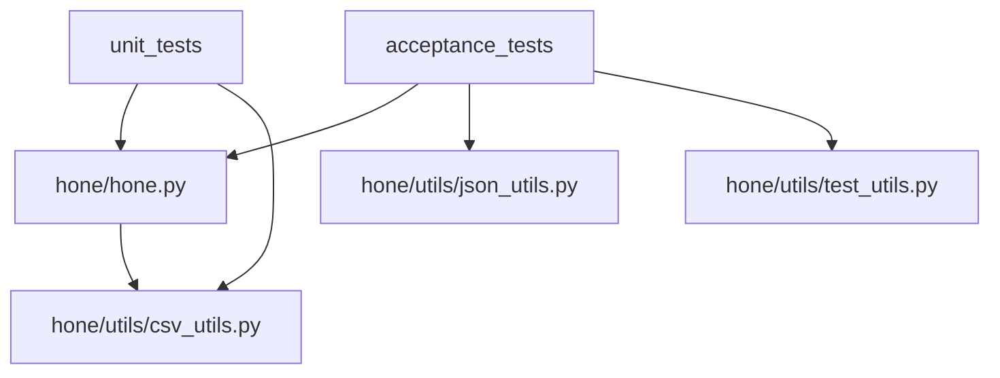

```mermaid
graph TD
    P1["hone/hone.py"]
    P2["hone/utils/csv_utils.py"]
    P3["hone/utils/json_utils.py"]
    P4["hone/utils/test_utils.py"]
    P5["unit_tests"]
    P6["acceptance_tests"]

    P1 --> P2
    P5 --> P1
    P5 --> P2
    P6 --> P1
    P6 --> P3
    P6 --> P4
```