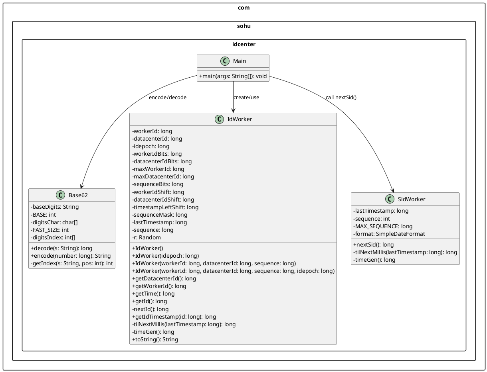

```plantuml
@startuml
skinparam classAttributeIconSize 0
skinparam shadowing false
skinparam packageStyle rectangle

package "com.sohu.idcenter" {

    class Base62 {
        -baseDigits: String
        -BASE: int
        -digitsChar: char[]
        -FAST_SIZE: int
        -digitsIndex: int[]
        +decode(s: String): long
        +encode(number: long): String
        -getIndex(s: String, pos: int): int
    }

    class IdWorker {
        -workerId: long
        -datacenterId: long
        -idepoch: long
        -workerIdBits: long
        -datacenterIdBits: long
        -maxWorkerId: long
        -maxDatacenterId: long
        -sequenceBits: long
        -workerIdShift: long
        -datacenterIdShift: long
        -timestampLeftShift: long
        -sequenceMask: long
        -lastTimestamp: long
        -sequence: long
        -r: Random
        +IdWorker()
        +IdWorker(idepoch: long)
        +IdWorker(workerId: long, datacenterId: long, sequence: long)
        +IdWorker(workerId: long, datacenterId: long, sequence: long, idepoch: long)
        +getDatacenterId(): long
        +getWorkerId(): long
        +getTime(): long
        +getId(): long
        -nextId(): long
        +getIdTimestamp(id: long): long
        -tilNextMillis(lastTimestamp: long): long
        -timeGen(): long
        +toString(): String
    }

    class SidWorker {
        -lastTimestamp: long
        -sequence: int
        -MAX_SEQUENCE: long
        -format: SimpleDateFormat
        +nextSid(): long
        -tilNextMillis(lastTimestamp: long): long
        -timeGen(): long
    }

    class Main {
        +main(args: String[]): void
    }
}

Main --> IdWorker : create/use
Main --> SidWorker : call nextSid()
Main --> Base62 : encode/decode

@enduml
```