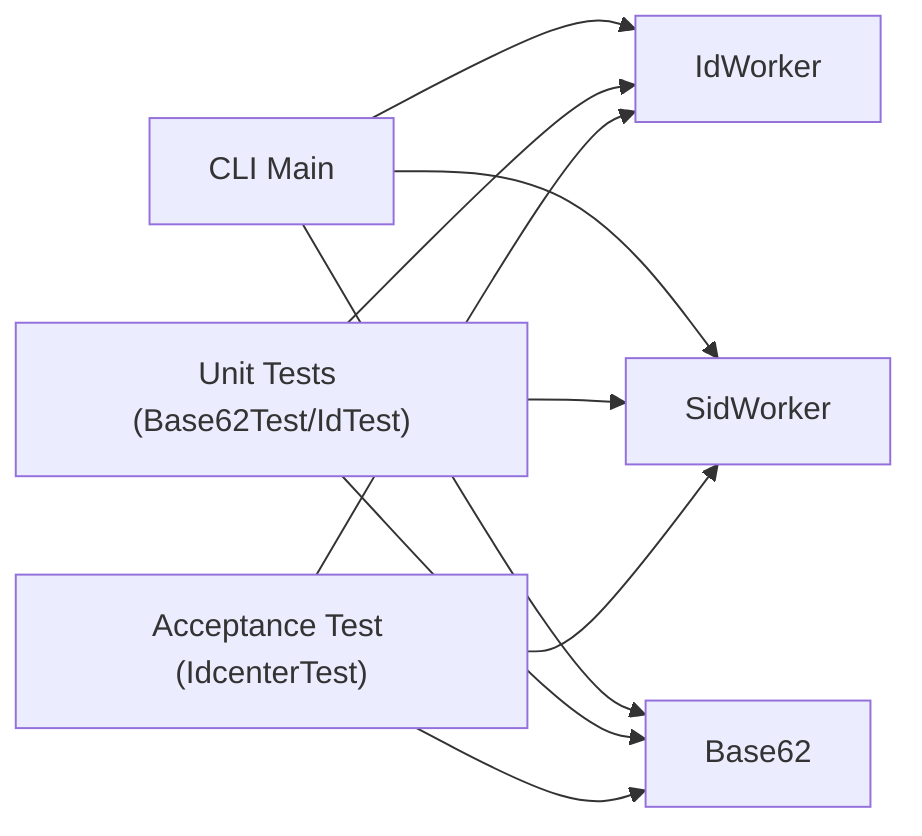

```mermaid
graph LR
    A["CLI Main"] --> B["IdWorker"]
    A --> C["SidWorker"]
    A --> D["Base62"]
    E["Unit Tests (Base62Test/IdTest)"] --> B
    E --> C
    E --> D
    F["Acceptance Test (IdcenterTest)"] --> B
    F --> C
    F --> D
```