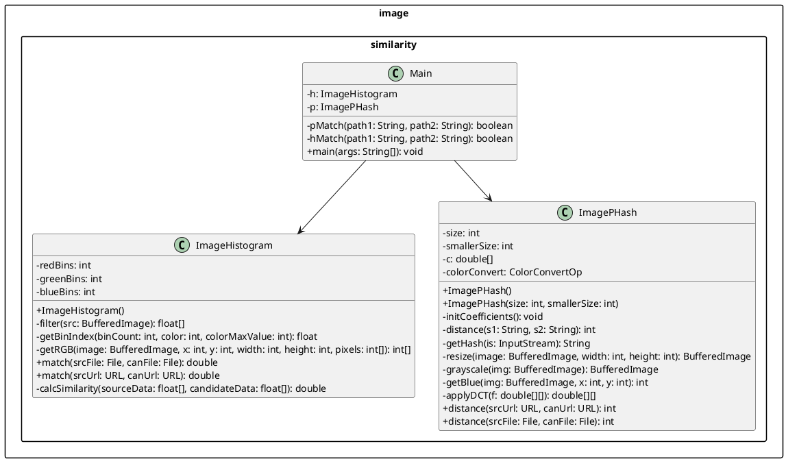

```plantuml
@startuml
skinparam classAttributeIconSize 0
skinparam shadowing false
skinparam packageStyle rectangle

package "image.similarity" {

    class ImageHistogram {
        -redBins: int
        -greenBins: int
        -blueBins: int
        +ImageHistogram()
        -filter(src: BufferedImage): float[]
        -getBinIndex(binCount: int, color: int, colorMaxValue: int): float
        -getRGB(image: BufferedImage, x: int, y: int, width: int, height: int, pixels: int[]): int[]
        +match(srcFile: File, canFile: File): double
        +match(srcUrl: URL, canUrl: URL): double
        -calcSimilarity(sourceData: float[], candidateData: float[]): double
    }

    class ImagePHash {
        -size: int
        -smallerSize: int
        -c: double[]
        -colorConvert: ColorConvertOp
        +ImagePHash()
        +ImagePHash(size: int, smallerSize: int)
        -initCoefficients(): void
        -distance(s1: String, s2: String): int
        -getHash(is: InputStream): String
        -resize(image: BufferedImage, width: int, height: int): BufferedImage
        -grayscale(img: BufferedImage): BufferedImage
        -getBlue(img: BufferedImage, x: int, y: int): int
        -applyDCT(f: double[][]): double[][]
        +distance(srcUrl: URL, canUrl: URL): int
        +distance(srcFile: File, canFile: File): int
    }

    class Main {
        -h: ImageHistogram
        -p: ImagePHash
        -pMatch(path1: String, path2: String): boolean
        -hMatch(path1: String, path2: String): boolean
        +main(args: String[]): void
    }
}

Main --> ImageHistogram
Main --> ImagePHash

@enduml
```