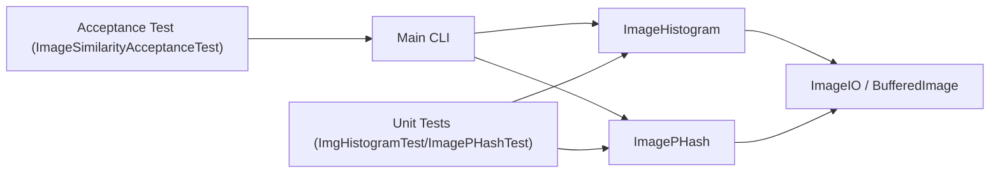

```mermaid
graph LR
    A["Main CLI"] --> B["ImageHistogram"]
    A --> C["ImagePHash"]
    B --> D["ImageIO / BufferedImage"]
    C --> D
    E["Unit Tests (ImgHistogramTest/ImagePHashTest)"] --> B
    E --> C
    F["Acceptance Test (ImageSimilarityAcceptanceTest)"] --> A
```