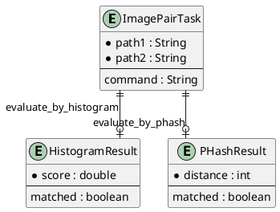

```plantuml
@startuml
skinparam linetype ortho
skinparam shadowing false

entity "ImagePairTask" as Task {
  * path1 : String
  * path2 : String
  --
  command : String
}

entity "HistogramResult" as HResult {
  * score : double
  --
  matched : boolean
}

entity "PHashResult" as PResult {
  * distance : int
  --
  matched : boolean
}

Task ||--o| HResult : evaluate_by_histogram
Task ||--o| PResult : evaluate_by_phash

@enduml
```