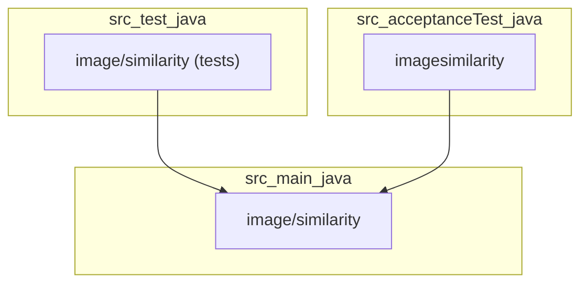

```mermaid
graph TD
    subgraph src_main_java
        P1["image/similarity"]
    end

    subgraph src_test_java
        P2["image/similarity (tests)"]
    end

    subgraph src_acceptanceTest_java
        P3["imagesimilarity"]
    end

    P2 --> P1
    P3 --> P1
```