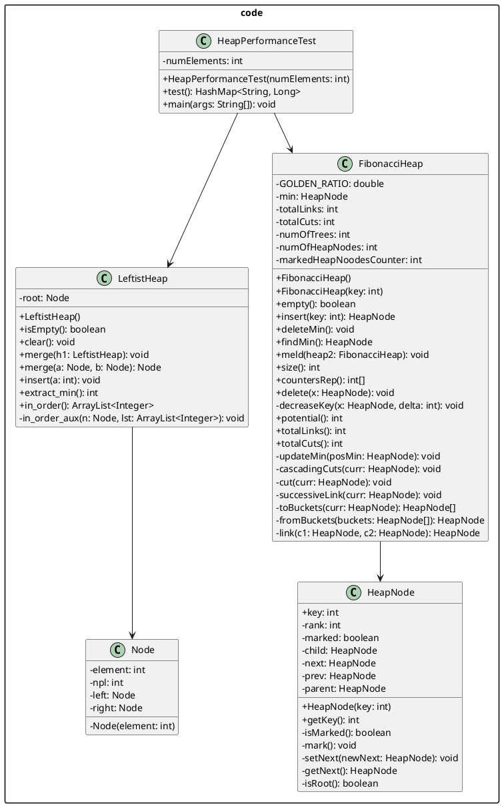

```plantuml
@startuml
skinparam classAttributeIconSize 0
skinparam shadowing false
skinparam packageStyle rectangle

package "code" {

    class LeftistHeap {
        -root: Node
        +LeftistHeap()
        +isEmpty(): boolean
        +clear(): void
        +merge(h1: LeftistHeap): void
        +merge(a: Node, b: Node): Node
        +insert(a: int): void
        +extract_min(): int
        +in_order(): ArrayList<Integer>
        -in_order_aux(n: Node, lst: ArrayList<Integer>): void
    }

    class Node {
        -element: int
        -npl: int
        -left: Node
        -right: Node
        -Node(element: int)
    }

    class FibonacciHeap {
        -GOLDEN_RATIO: double
        -min: HeapNode
        -totalLinks: int
        -totalCuts: int
        -numOfTrees: int
        -numOfHeapNodes: int
        -markedHeapNoodesCounter: int
        +FibonacciHeap()
        +FibonacciHeap(key: int)
        +empty(): boolean
        +insert(key: int): HeapNode
        +deleteMin(): void
        +findMin(): HeapNode
        +meld(heap2: FibonacciHeap): void
        +size(): int
        +countersRep(): int[]
        +delete(x: HeapNode): void
        -decreaseKey(x: HeapNode, delta: int): void
        +potential(): int
        +totalLinks(): int
        +totalCuts(): int
        -updateMin(posMin: HeapNode): void
        -cascadingCuts(curr: HeapNode): void
        -cut(curr: HeapNode): void
        -successiveLink(curr: HeapNode): void
        -toBuckets(curr: HeapNode): HeapNode[]
        -fromBuckets(buckets: HeapNode[]): HeapNode
        -link(c1: HeapNode, c2: HeapNode): HeapNode
    }

    class HeapNode {
        +key: int
        -rank: int
        -marked: boolean
        -child: HeapNode
        -next: HeapNode
        -prev: HeapNode
        -parent: HeapNode
        +HeapNode(key: int)
        +getKey(): int
        -isMarked(): boolean
        -mark(): void
        -setNext(newNext: HeapNode): void
        -getNext(): HeapNode
        -isRoot(): boolean
    }

    class HeapPerformanceTest {
        -numElements: int
        +HeapPerformanceTest(numElements: int)
        +test(): HashMap<String, Long>
        +main(args: String[]): void
    }
}

LeftistHeap --> Node
FibonacciHeap --> HeapNode
HeapPerformanceTest --> FibonacciHeap
HeapPerformanceTest --> LeftistHeap

@enduml
```