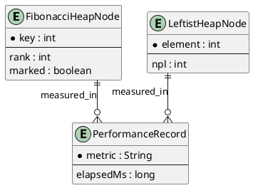

```plantuml
@startuml
skinparam linetype ortho
skinparam shadowing false

entity "FibonacciHeapNode" as FNode {
  * key : int
  --
  rank : int
  marked : boolean
}

entity "LeftistHeapNode" as LNode {
  * element : int
  --
  npl : int
}

entity "PerformanceRecord" as Perf {
  * metric : String
  --
  elapsedMs : long
}

FNode ||--o{ Perf : measured_in
LNode ||--o{ Perf : measured_in

@enduml
```