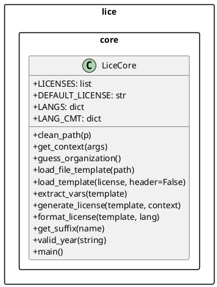

```plantuml
@startuml
skinparam classAttributeIconSize 0
skinparam shadowing false
skinparam packageStyle rectangle

package "lice.core" {
  class LiceCore {
    +LICENSES: list
    +DEFAULT_LICENSE: str
    +LANGS: dict
    +LANG_CMT: dict
    +clean_path(p)
    +get_context(args)
    +guess_organization()
    +load_file_template(path)
    +load_template(license, header=False)
    +extract_vars(template)
    +generate_license(template, context)
    +format_license(template, lang)
    +get_suffix(name)
    +valid_year(string)
    +main()
  }
}

@enduml
```