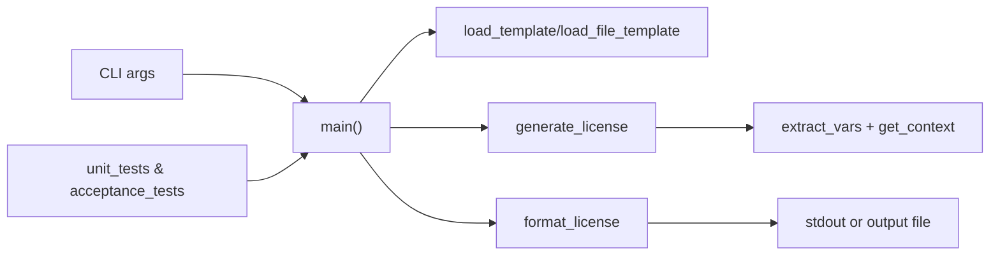

```mermaid
graph LR
    A["CLI args"] --> B["main()"]
    B --> C["load_template/load_file_template"]
    B --> D["generate_license"]
    D --> E["extract_vars + get_context"]
    B --> F["format_license"]
    F --> G["stdout or output file"]
    H["unit_tests & acceptance_tests"] --> B
```